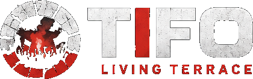

<div align="center">



### The Living Terrace — a peer-to-peer home for football fans

**Build the terrace. Preserve the echo.**

[](LICENSE)


</div>

---

## What is TIFO?

TIFO is a **peer-to-peer "living terrace"** where football fans don't just chat — they
collectively build and replay the _atmosphere_ of a match in real time: synchronized chants,
visual flares, goal reactions, highlight clips, and shared memory.

There are **no servers, no accounts, and no Big Tech** in between. Fans connect directly with the
[Pears stack](https://docs.pears.com) (Hyperswarm, Hypercore, Autobase), and on-device AI
([QVAC](https://qvac.tether.io)) translates chats and chants locally — no cloud, nothing leaves the
device.

The signature feature is the **Echo System**: every reaction becomes part of a shared,
append-only, peer-merged timeline. Later — at half-time, full-time, or when a fan joins late — the
room can hit **Replay Echo** and relive the peak moment in sync.

> A normal app captures messages. TIFO captures **atmosphere**.

---

## Features

- **P2P match rooms** — join by fixture or invite link; peers connect directly via Hyperswarm.
- **Real-time chat** — text, replies, edits, reactions, read receipts, typing indicators.
- **Live reactions & flares** — goal, save, VAR, penalty, full-time, fire — felt across the room.
- **Audio chants** — record short chants that become part of the room's memory.
- **Highlight clips & images** — share media peer-to-peer.
- **The Echo System** — a multi-writer, causally-ordered timeline merged with **Autobase**.
- **Replay Echo** — a full-screen theater that replays a moment's chants, flares and clips in sync.
- **On-device translation (QVAC)** — understand chats and chants in any language, locally.
- **Offline-first** — actions save locally and sync automatically on reconnect.
- **Private rooms & DMs** — invite-key rooms and peer-to-peer direct messages.
- **Local-first identity** — your profile and keys live on your device (`keet-identity-key`).

---

## Tech stack

| Layer             | Technology                                                                      |
| ----------------- | ------------------------------------------------------------------------------- |
| P2P networking    | **Hyperswarm** (topic discovery), **Protomux** (room control protocol)          |
| Data & storage    | **Hypercore** + **Corestore**; **Autobase** for the multi-writer Echo timeline  |
| Runtime           | **Pear** / **Bare** worker embedded in an **Electron** shell                    |
| On-device AI      | **QVAC SDK** (Bergamot NMT translation, Whisper transcription)                  |
| UI                | **React 19**, **Vite**, **Tailwind CSS 4**, **framer-motion**, **lucide-react** |
| Identity & crypto | **keet-identity-key**, **sodium-universal** (signed events)                     |

---

## Quick start

**Requirements:** Node.js ≥ 20, npm ≥ 10, Linux/macOS/Windows.

```sh
# 1. install
npm install

# 2. run the app (builds the renderer, then launches Electron + the Bare worker)
npm start
```

### Run multiple peers locally (the real demo)

Each instance needs its own storage directory so they behave like separate devices:

```sh
npm start -- --storage /tmp/tifo-amina
npm start -- --storage /tmp/tifo-yassine
npm start -- --storage /tmp/tifo-salma
```

Create or join the same room in each window and watch peers, chat, reactions and the Echo timeline
sync directly between them — no server involved.

> **Translation note:** the first time you translate, TIFO downloads a small Bergamot model. This
> needs the internet **once**; afterwards translation runs fully offline. See
> [`docs/qvac.md`](docs/qvac.md).

---

## Scripts

| Command                    | Description                                           |
| -------------------------- | ----------------------------------------------------- |
| `npm start`                | Build the renderer and launch the app                 |
| `npm run build:renderer`   | Build the React renderer (Vite) into `renderer-dist/` |
| `npm run lint`             | `prettier --check` + `lunte`                          |
| `npm run format`           | Auto-format with prettier + lunte                     |
| `npm run package`          | Package the app with Electron Forge                   |
| `npm run make`             | Build platform distributables                         |
| `npm run smoke:two-window` | Launch two instances for a quick P2P smoke test       |

---

## Architecture at a glance

```
┌───────────────────────────── Electron main (electron/main.js) ─────────────────────────────┐
│  • Spawns the Bare worker via pear-runtime (FramedStream IPC)                                │
│  • Hosts the QVAC translation service (electron/qvac-service.js)                             │
│  • Bridges everything to the renderer through electron/preload.js                            │
└───────────────┬─────────────────────────────────────────────────────────────┬──────────────┘
                │ framed IPC                                                    │ contextBridge
        ┌───────▼─────────── Bare worker (workers/main.js) ───────┐    ┌────────▼───────────────┐
        │ • Corestore (local Hypercores)                          │    │ Renderer (React/Vite)  │
        │ • Hyperswarm × (updates · app presence · room)          │    │ • useTifoController     │
        │ • Protomux room-control protocol                        │    │ • Chat / Match / Home   │
        │ • Autobase Echo timeline (tifo-echo-timeline.js)        │    │ • Replay theater modal  │
        │ • Mailbox DMs, identity, signed events                  │    │ • QVAC translate UI     │
        └─────────────────────────────────────────────────────────┘    └─────────────────────────┘
```

Deeper dives live in [`/docs`](docs):

- [`docs/architecture.md`](docs/architecture.md) — runtime layers, IPC, data model, the Echo System.
- [`docs/pears.md`](docs/pears.md) — how TIFO uses Hyperswarm, Hypercore, Autobase & offline sync.
- [`docs/qvac.md`](docs/qvac.md) — on-device translation, model download, offline behavior.
- [`docs/running.md`](docs/running.md) — development, multi-peer demo, storage, packaging.
- [`docs/demo.md`](docs/demo.md) — a tight live-demo script.

---

## Project structure

```
electron/         Electron main process + preload + QVAC translation service
workers/          Bare/Pear worker: P2P networking, Corestore, Autobase Echo timeline, mailbox
renderer/         React UI (Vite + Tailwind)
  src/components/   Home, Chat, Match room, Replay modal, onboarding, splash
  src/hooks/        useTifoController — the renderer state controller
  src/tifo/         Domain helpers: invites, identity, rooms, media, notifications, replay
qvac/             Generated QVAC worker bundle + addon manifest (build artifacts)
assets/brand/     Logos and brand imagery
docs/             Architecture, Pears, QVAC, running and demo guides
```

---

## Privacy & security

- **Local-first:** rooms, messages, media and identity are stored on-device; there is no central
  server that holds the "real" copy.
- **Direct & encrypted:** peers connect over Hyperswarm's end-to-end encrypted streams.
- **On-device AI:** QVAC runs translation locally; message text never leaves the machine for
  inference (models are fetched once, then cached).
- **Signed events:** room events are signed with the local identity key.

---

## License

[MIT](LICENSE) © TIFO — built on [Pears](https://docs.pears.com) + [QVAC](https://qvac.tether.io).

<div align="center"><sub>The crowd lives on.</sub></div>
